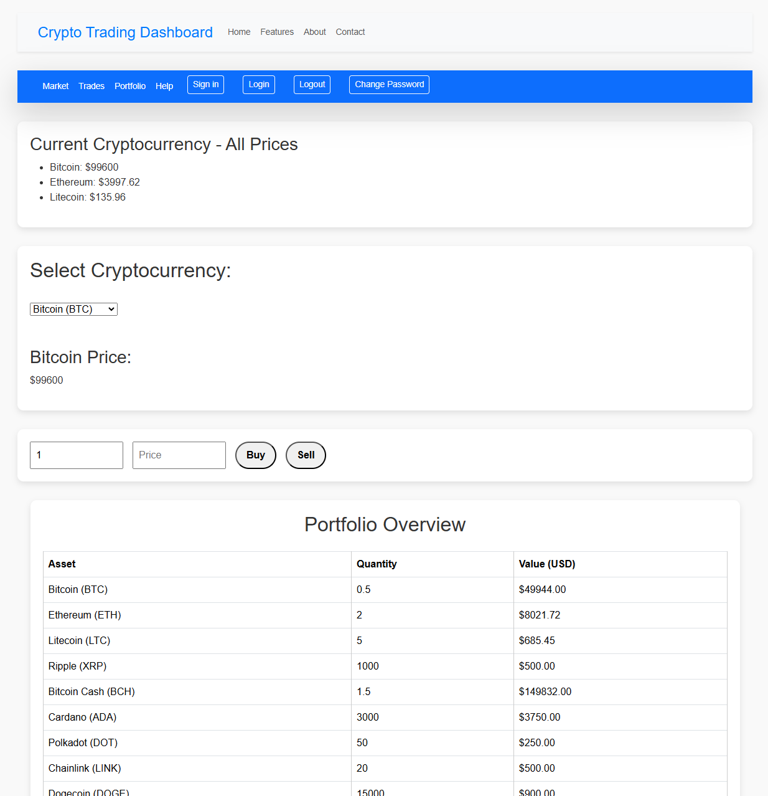

# Crypto Trading Simulation Backend

This is the backend service for the Crypto Trading Simulation application. It is built with FastAPI and provides RESTful APIs for user management, trading, portfolio management, and other core functionalities. The backend connects to a MongoDB database and serves data and operations to the frontend application.

## App Impression

Here is an impression of how the Crypto Trading Simulation app looks:



---

## Features

- **Trading Simulation**: Simulate cryptocurrency trades and manage a virtual portfolio.
- **Real-Time Market Data**: Retrieve and simulate live market data for virtual trading.
- **Portfolio Management**: Track the performance and analyze the user's portfolio.
- **Notifications (Ongoing)**: Send notifications about portfolio updates and price changes.
- **User Authentication (Ongoing)**: Implement user registration and login using JWT-based authentication.

---

## Technologies

- **Python 3.x**
- **FastAPI**: The main web framework for the API.
- **MongoDB**: Database to store user, trade, and portfolio data.
- **Pymongo**: MongoDB connector for Python.
- **React.js**: The JavaScript library used for building the frontend UI.
  - **TypeScript**: Superset of JavaScript used for type safety and better development experience (used in this project).
  - **React Router**: Library for handling routing in React applications.
  - **Redux**: State management tool used to manage application state.
  - **Axios**: Promise-based HTTP client used for making API requests from the frontend.
  - **Material UI**: React UI framework for building responsive and accessible user interfaces.

---

## Setup and Installation

### Prerequisites

- **Python 3.x** installed on your machine.
- **MongoDB** database setup (local or cloud-based).

### Steps

1. **Clone the repository**:

    ```bash
    git clone https://github.com/your-username/crypto-trading-simulation.git
    cd crypto-trading-simulation/backend
    ```

2. **Install dependencies**:

    Install all necessary Python packages using `requirements.txt`.

    ```bash
    pip install -r requirements.txt
    ```

3. **Environment Configuration**:

    Create a `.env` file in `backend/app` and add your MongoDB connection string and any other required configurations.

    ```env
    MONGO_URI="your_mongo_connection_string"
    SECRET_KEY="your_jwt_secret_key"
    ```

4. **Run the Application**:

    Start the FastAPI server:

    ```bash
    uvicorn app.main:app --reload --host 127.0.0.1 --port 8000
    ```

5. **API Documentation**:

    Access the interactive API documentation at `http://127.0.0.1:8000/docs`.

## Testing

Run tests with pytest:

```bash
pytest app/tests
```

This will execute the tests in the `tests` directory, checking for any issues in the backend functionalities.

---

## Deployment

### Docker Deployment

The backend can be easily deployed using Docker. Below are the steps to build and deploy the backend in a Docker container:

1. **Create a Dockerfile for the Backend**:

    The backend should have a `Dockerfile` inside the `backend` directory. Here's an example:

    ```Dockerfile
    # Use the official Python image as a base
    FROM python:3.9-slim

    # Set the working directory inside the container
    WORKDIR /app

    # Copy the current directory contents into the container
    COPY . /app

    # Install dependencies
    RUN pip install --no-cache-dir -r requirements.txt

    # Expose port 8000 for FastAPI
    EXPOSE 8000

    # Run the FastAPI application
    CMD ["uvicorn", "app.main:app", "--host", "0.0.0.0", "--port", "8000"]
    ```

2. **Build and Run the Docker Container**:

    Build and run the container using the following commands:

    ```bash
    # Navigate to the backend directory
    cd backend

    # Build the Docker image
    docker build -t crypto-trading-backend .

    # Run the container
    docker run -p 8000:8000 crypto-trading-backend
    ```

3. **Kubernetes Deployment**:

    If you want to deploy the backend on a Kubernetes cluster, you need to create a `Deployment` and `Service` YAML files.

    - **`backend-deployment.yaml`**:

    ```yaml
    apiVersion: apps/v1
    kind: Deployment
    metadata:
      name: crypto-backend-deployment
    spec:
      replicas: 3
      selector:
        matchLabels:
          app: crypto-backend
      template:
        metadata:
          labels:
            app: crypto-backend
        spec:
          containers:
            - name: crypto-backend
              image: crypto-trading-backend:latest
              ports:
                - containerPort: 8000
    ```

    - **`backend-service.yaml`**:

    ```yaml
    apiVersion: v1
    kind: Service
    metadata:
      name: crypto-backend-service
    spec:
      selector:
        app: crypto-backend
      ports:
        - protocol: TCP
          port: 80
          targetPort: 8000
      type: LoadBalancer
    ```

    To deploy to Kubernetes, apply the YAML files:

    ```bash
    kubectl apply -f backend-deployment.yaml
    kubectl apply -f backend-service.yaml
    ```

4. **Accessing the Backend**:

    Once the backend is deployed and exposed via a service (with LoadBalancer type), you can access the backend using the external IP assigned to the service.

### Frontend Deployment

For deploying the frontend, ensure you have the Docker configuration for the frontend as well. The process is similar:

1. **Dockerfile for Frontend**:

    Here's an example `Dockerfile` for the frontend application (inside the `frontend` directory):

    ```Dockerfile
    # Use the official Node.js image as a base
    FROM node:16-slim

    # Set the working directory inside the container
    WORKDIR /app

    # Copy the package.json and install dependencies
    COPY package.json /app
    RUN npm install

    # Copy the rest of the application
    COPY . /app

    # Build the React app
    RUN npm run build

    # Expose port 3000 for the frontend
    EXPOSE 3000

    # Start the React app
    CMD ["npm", "start"]
    ```

2. **Build and Run the Frontend Docker Container**:

    Build and run the container:

    ```bash
    # Navigate to the frontend directory
    cd frontend

    # Build the Docker image
    docker build -t crypto-trading-frontend .

    # Run the container
    docker run -p 3000:3000 crypto-trading-frontend
    ```

3. **Kubernetes Deployment for Frontend**:

    Similar to the backend, you need to create a `Deployment` and `Service` YAML files for the frontend.

    - **`frontend-deployment.yaml`**:

    ```yaml
    apiVersion: apps/v1
    kind: Deployment
    metadata:
      name: crypto-frontend-deployment
    spec:
      replicas: 3
      selector:
        matchLabels:
          app: crypto-frontend
      template:
        metadata:
          labels:
            app: crypto-frontend
        spec:
          containers:
            - name: crypto-frontend
              image: crypto-trading-frontend:latest
              ports:
                - containerPort: 3000
    ```

    - **`frontend-service.yaml`**:

    ```yaml
    apiVersion: v1
    kind: Service
    metadata:
      name: crypto-frontend-service
    spec:
      selector:
        app: crypto-frontend
      ports:
        - protocol: TCP
          port: 80
          targetPort: 3000
      type: LoadBalancer
    ```

    Deploy to Kubernetes:

    ```bash
    kubectl apply -f frontend-deployment.yaml
    kubectl apply -f frontend-service.yaml
    ```

4. **Accessing the Frontend**:

    Similar to the backend, once the frontend is deployed and exposed, you can access it via the external IP or load balancer.

---
